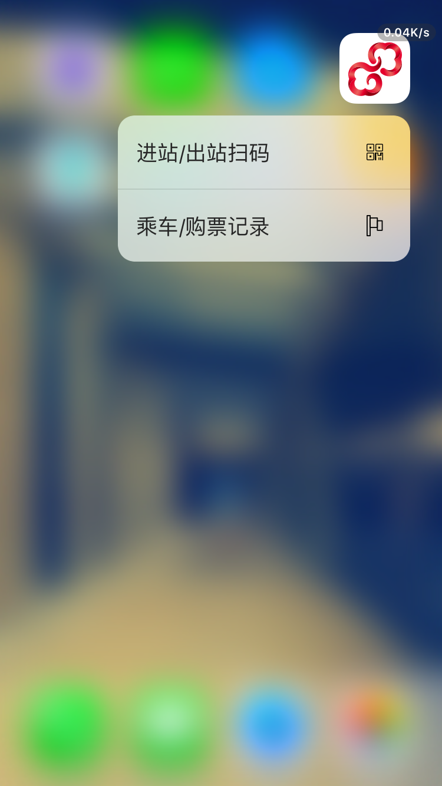

# YiTongXingPlugin

### 说明
* 免责声明：本项目旨在学习 iOS 逆向的一点实践，不可使用于商业和个人其他意图。若使用不当，均由个人承担。
* 包含功能：为易通行APP 添加 3DTouch ShortcutItem，支持快捷扫码和查看历史记录。。
* 希望官方APP添加此功能，代码直接拖进去稍微修改下就可以用了。

### 安装

 1. 这个是越狱插件，需要一个越狱设备并安装OpenSSH。没有越狱设备的请转[YiTongXiongPlugin-iOS](https://github.com/CodeTips/YiTongXiongPlugin-iOS).
 2. 首先需要安装[theos](https://github.com/theos/theos)，详情查看[教程地址](https://codetips.net/2018/06/09/%E9%80%86%E5%90%91%E5%BC%80%E5%8F%91-iOS%E8%B6%8A%E7%8B%B1%E5%BC%80%E5%8F%91%EF%BC%88%E4%B8%80%EF%BC%89/).
 3. 再安装iproxy，命令`brew install
    usbmuxd`。没有安装brew的需要先安装brew，命令`/usr/bin/ruby -e "$(curl -fsSL
    https://raw.githubusercontent.com/Homebrew/install/master/install)"`

以上工具都安装完成以后，`clone or download`下载项目并解压。电脑通过USB连接iPhone。 打开个终端，执行 `iproxy 2222 22`.然后再打开一个新的终端，进入`YiTongXing`目录，执行`make package install`,安装成功即可。

### 依赖

* [theos](https://github.com/theos/theos)

### 最后
* 使用愉快~